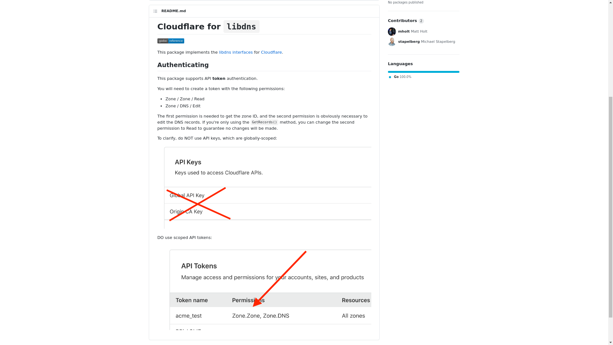
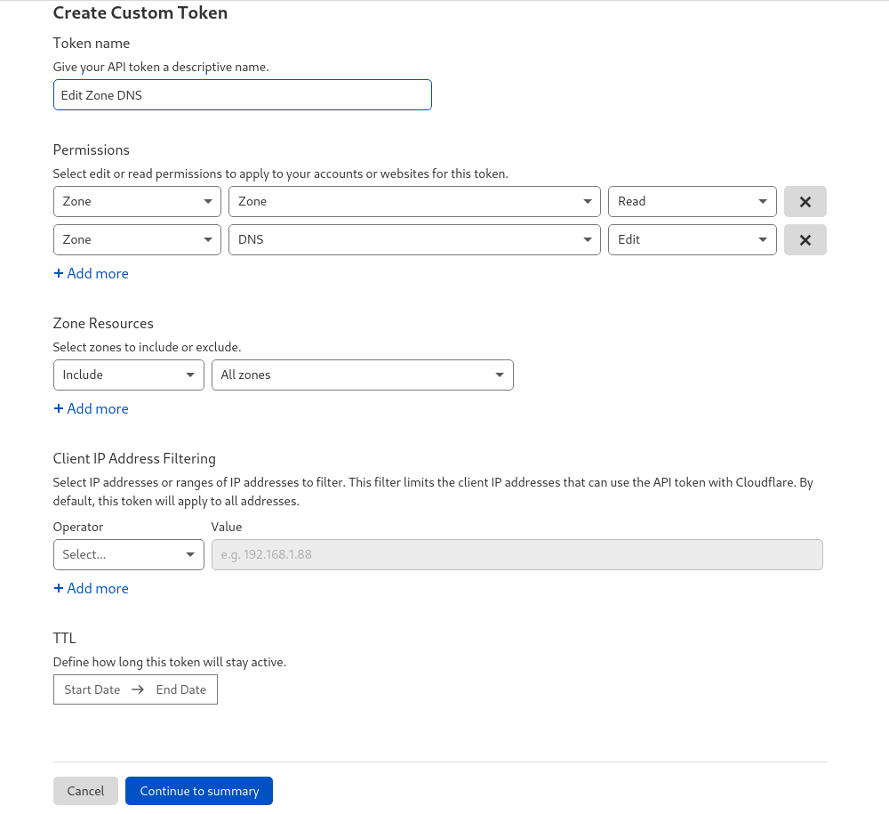

## openssl版本

###
	https://github.com/sdhz153/Text/blob/main/openssl.md
###

## 更新系统

###
	apt-get update && apt-get upgrade
###

## 基础工具下载安装

###
	apt update && apt -y install build-essential libnss3 libpcre3 libpcre3-dev zlib1g-dev git dbus manpages-dev aptitude g++ wget curl unzip gcc
###

### 校准时间

###
	ln -sf /usr/share/zoneinfo/Asia/Shanghai /etc/localtime && date -R
###

## 下载安装GO编程语言

###
	wget https://golang.org/dl/go1.17.linux-amd64.tar.gz
###

## 解压至/usr/local/

###
	tar -C /usr/local -xzf go1.17.linux-amd64.tar.gz
###

## 在/etc/profile中添加 Go 环境变量:

###
	echo "export PATH=$PATH:/usr/local/go/bin" >> /etc/profile
###

## 使修改的配置文件立即生效

###
	source /etc/profile
###

## 编译安装 Caddy

###
	go install github.com/caddyserver/xcaddy/cmd/xcaddy@latest
###

## 编译安装(下面的插件感觉不需要的可以去掉)

###
	~/go/bin/xcaddy build \
		--with github.com/abiosoft/caddy-exec \
		--with github.com/caddy-dns/cloudflare \
		--with github.com/caddy-dns/dnspod \
		--with github.com/caddy-dns/alidns \
		--with github.com/mholt/caddy-l4 \
		--with github.com/greenpau/caddy-trace \
		--with github.com/hairyhenderson/caddy-teapot-module \
		--with github.com/kirsch33/realip \
		--with github.com/porech/caddy-maxmind-geolocation \
		--with github.com/caddyserver/format-encoder \
		--with github.com/mholt/caddy-webdav
###

## 创建文件夹

###
	mkdir -p /usr/share/caddy/ /etc/ssl/caddy/ /var/log/caddy/
###

## 创建文件

###
	touch /var/log/caddy/access.log /root/Caddyfile
###

## 修改Caddyfile

###
	https://github.com/sdhz153/Text/blob/main/caddy2/Caddyfile
###

## 获得 Cloudflare API token

## 在 Cloudfalre 网站点击右上角 人物图--->MY Profile------> (最左边找到 { } 这个标志)API 选项

## 或

###		
	https://dash.cloudflare.com/profile/api-tokens
###

## 创建caddy.service

###
	cat >/etc/systemd/system/caddy.service <<EOF
	[Unit]
	Description=Caddy
	Documentation=https://caddyserver.com/docs/
	After=network.target network-online.target
	Requires=network-online.target

	[Service]
	User=root
	ExecStart=/root/caddy run --environ --config /root/Caddyfile
	ExecReload=/root/caddy reload --config /root/Caddyfile
	TimeoutStopSec=5s
	LimitNOFILE=1048576
	LimitNPROC=512
	PrivateTmp=true
	ProtectSystem=full
	AmbientCapabilities=CAP_NET_BIND_SERVICE

	[Install]
	WantedBy=multi-user.target
	EOF
###

## 安装伪网站自己找,解压至/usr/share/caddy
===========================================

## 开启BBR加速（可跳过）

###
	echo "net.core.default_qdisc=fq" >> /etc/sysctl.conf && echo "net.ipv4.tcp_congestion_control=bbr" >> /etc/sysctl.conf && sysctl -p && lsmod | grep bbr
###

##============出现缓冲过小错误时============
## 建议通过运行来增加最大缓冲区大小：

###
	sysctl -w net.core.rmem_max=2500000
###

##安装xray

###
	bash -c "$(curl -L https://github.com/XTLS/Xray-install/raw/main/install-release.sh)" @ install
###

## 编辑 /etc/Xray/config.json

###
	https://github.com/sdhz153/Text/blob/main/caddy2/etc/xray/config.json
###

## ==========================开启服务===========================

## 重载systemctl服务

###
	systemctl daemon-reload
###

## 开启caddy2

###
	systemctl start caddy && systemctl status caddy
###

## 设置为开机自动启动

###
	systemctl enable caddy
###

## 每次修改后都要执行一次重启

###
	systemctl restart caddy
###

## 停止caddy

###
	service caddy stop
###

## 启动 XTLS

###
	systemctl start xray
###
###
	systemctl status xray
###

## 设置为开机自动启动

###
	systemctl enable xray
###

## 每次修改后都要执行一次重启

###
	systemctl restart xray
###